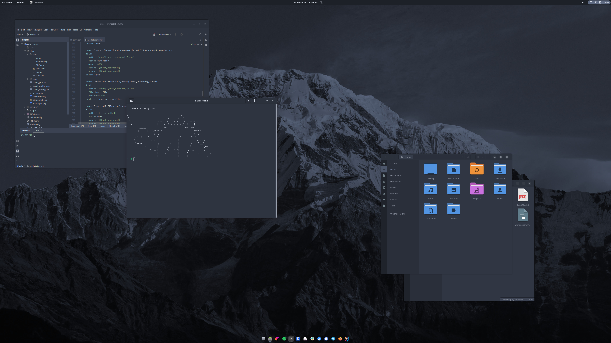

# .dots

New and upgraded dotfiles, now with Ansible!

## What is this?

This is an Ansible project I use to configure and maintain my personal workstations, install software, manage
dotfiles, manage the configuration and more.

## Danger, Will Robinson!

For obvious reasons, you **should not** apply this configuration on your own machine. Doing so **will break your stuff**
, **replace it with my stuff** and possibly, **kill your cat** or any other household pets you might have in the
immediate vicinity.

You can definitely use this repository to bootstrap your own setup and to try it all out on a disposable virtual
machine.

The master branch is compatible with Fedora 36. There might be other branches for other operating systems,
but these are NOT maintained!

## Goals and non-goals

The goal is to be able to configure my desktop environment on a fresh machine installs as fast as possible and with
as few manual steps as possible.

Having a production grade Ansible project is not a goal of this repository, however I will try my best to keep the roles
and such somewhat maintainable for the benefit of my own, personal sanity. If you are looking for examples on how to
write production Ansible roles to be shared with others - this is NOT a good example (though it could help you get
started). Many shortcuts have been taken here because it is acceptable to *me*.

## What is automated

- Large portion of the operating system installation (see [autoinstall.conf](./autoinstall.conf)).
- Personal dotfiles, shell setup, etc.
- Nearly all the software I use on my workstations (sans user configs @ todo).
- Defaults for themes, fonts, dconf settings for GNOME3 and extensions.
- Some security defaults, SSHD config etc.

## Components

- GNOME desktop.
- [Arc Menu](https://extensions.gnome.org/extension/1228/arc-menu/) extension.
- [Dash to Panel](https://extensions.gnome.org/extension/1160/dash-to-panel/) extension.
- [OpenWeather](https://extensions.gnome.org/extension/750/openweather/) extension.
- [User Themes](https://extensions.gnome.org/extension/19/user-themes/) extension.
- Arc Dark GTK theme and shell theme.
- Papirus Dark icons.
- [IBM Plex](https://www.ibm.com/plex/) and [JetBrains Mono](https://www.jetbrains.com/lp/mono/) fonts.
- ... software, tools, things.

### dconf settings and system defaults

Desktop user experience configuration is set as a system wide default profile instead of using per-user settings.
This is done on purpose - not all of my machines are exactly the same and by using system defaults I can still override
some settings locally without having them later reverted by Ansible.

## How to use

### Using manual installation

1. Set up machine with basic installation of Fedora with **minimal desktop environment**.
    - SSH server is required if you plan to complete the installation remotely.
2. Move to non-default TTY or SSH into the machine remotely.
3. Install Ansible and other dependencies `sudo apt install python3 python3-pip git`
4. Install Ansible `sudo pip3 install ansible`
5. Clone this repository somewhere. I usually use `~/dots/`.
6. Edit `workstation.yml` as required.

`ansible-playbook -i hosts workstation.yml -K -C` to run Ansible in check mode.
`ansible-playbook -i hosts workstation.yml -K` to run Ansible against localhost.

Setup requires root privileges (but of course it does). Ansible will ask you for your password to become root user.
This is required because Ansible automates package installation, changes settings only accessible to root etc.

Once the playbooks are applied, you might need to reboot.

### How to modify and use

1. Fork this repository.
2. Review and modify [workstation playbook](./workstation.yml).
3. Review and modify [files](./files) and [templates](./templates).
5. Commit and push your changes to your fork.
6. Follow the "How to use" as described above.

**IMPORTANT**: you should NEVER add anything you want to keep secret to a public repository, including passwords,
private keys and such.

## Things not yet automated

- Gnome shell extensions are not automatically installed, but are required
    - Arc menu for GNOME [<3.34](https://extensions.gnome.org/extension/1228/arc-menu/)
      , [>3.34](https://extensions.gnome.org/extension/3628/arcmenu/)
    - [Dash to panel](https://extensions.gnome.org/extension/1160/dash-to-panel/)
    - [OpenWeather](https://extensions.gnome.org/extension/750/openweather/)
    - [UserThemes](https://extensions.gnome.org/extension/19/user-themes/)
- [JetBrains Toolbox](https://www.jetbrains.com/toolbox-app/) (no deb available).

## Known issues

- During initial setup, `dconf update` might not be executed properly and might need to be run second time manually
  after all changes are applied. Simply sign in and run `dconf update` as `root`.

## Motivation

Till about June 2020, Elementary was my distribution of choice for all of my personal workstation machines. All of them
were semi-managed using a combination of shell scripts and manual work.

Several changes in Elementary itself, Ubuntu upstream, and some less objective reasons (I was really bored one night)
lead me to the decision that Elementary might no longer fit my personal use case as well as it did when I first
started using it. GNOME has changed a lot since 2012, and so has everything related to it.

I tried several distributions for a couple of days each to determine how they could integrate into my workflows and
daily life, finally settling on Debian with which I have a long prior history - it is my operating system of choice for
all my personal servers, and was my main desktop operating system before mid-2012, before I moved to Elementary. In
fact, the very first Linux operating system I was ever exposed to was Debian, version 2.2 at the time - almost 20 years
ago.

While having a spare machine set aside to try an operating system is fairly trivial, moving your entire "baggage" of
tools, configuration and software to similar, albeit somewhat different distribution is not nearly so - especially if
you have multiple machines to maintain - several of which I use daily with several more that I use occasionally, but
still require having the same setup as my daily use machines.

This Ansible project was created to deal with the issue of synchronizing the working environments across all of my
physical machines and keep their configuration more or less the same over extended periods of time.

### Update from August 2022

Many things have changed since I wrote the above, most importantly

- I have reduced the number of physical machines I use often from ~5 down to just 2 - my main mobile workstation and my
  stationary desktop - which I now mostly use for media and occasional game or two.
- I have moved both of the machines to Fedora (which was quite trivial to achieve thanks to this Ansible project!)
- This repository has been greatly simplified to no longer rely on roles-based structure. Having just one playbook to
  include everything is simply more convenient - not necessarily the "correct" way.

## Credits

Wallpaper (c) 2020 [Kristaps Ungurs](https://unsplash.com/@kristapsungurs)

## FAQ 

### What about syncthing?

If you have one main, and one secondary machine, and you only ever make changes to one of them - sure, you
can use syncthing for dotfiles. You are limited to syncing files only. Overall I do not recommend this.

If you have more than 2 machines to configure, and you are looking to use syncthing to sync your configs and 
dotfiles - you probably should not. Or do if you like to break your stuff.

### What about git?

This project also uses git. And in theory, you could youst `.git` and `#!/bin/bash` your home directory
together - but why? This is so much easier to maintain.

### What about other 5,000 tools someone created to configure their machines/dotfiles?

At the end of the day, you can use whatever approach fits you best. Ansible is a standard tool used by
countless system administrators, ops professionals and developers for things much more serious than this.
So you would be in a good company, and there are few things you can't do with Ansible in <insert current year>.

### Does Ansible work on MAC?

Sure does. Homebrew package management, config file management and plenty other included.

### But but but my bootstrap scripts and manual copy-pasting of everything?!

Haha Ansible playbooks go brrr

    
